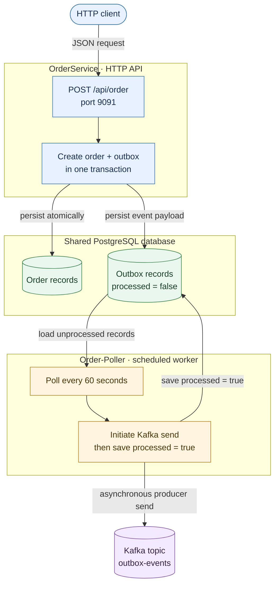

# Transactional Outbox Pattern

A Spring Boot example with two applications: **OrderService** accepts an order and stores it together with an outbox record in PostgreSQL; **Order-Poller** reads pending outbox records and sends messages to Kafka.

## Architecture



Both applications connect to the same PostgreSQL database. OrderService handles the synchronous HTTP request. Order-Poller runs independently; it has no HTTP endpoint. No Kafka consumer is included in this repository.

### Current flow

1. `POST /api/order` sends an order DTO to OrderService.
2. OrderService saves an `Order`, then saves an `Outbox` row containing the serialized order payload, in the same transaction.
3. Order-Poller queries all rows with `processed = false` every 60 seconds.
4. For each row, it initiates a Kafka send and then sets `processed = true`.

### Stored data and Kafka topic

- **Order:** generated ID, name, customer ID, product type, quantity, price, and order date.
- **Outbox:** generated ID, `aggregateId` (currently the customer ID), serialized order `payload`, creation time, and `processed` flag.
- **Topic:** defaults to `outbox-events`. The poller declares it with three partitions and replication factor one.

## Run locally

### Requirements

- JDK 17
- PostgreSQL with an existing database
- Kafka available to Order-Poller (default: `localhost:9092`)

Both applications must use the same database. The default JDBC URL is `jdbc:postgresql://localhost:5432/postgres`. In each terminal used to run an application, configure database access:

```bash
export DB_URL='jdbc:postgresql://localhost:5432/postgres'
export SPRING_DATASOURCE_USERNAME='postgres'
export SPRING_DATASOURCE_PASSWORD='your-local-password'
```

Start PostgreSQL and Kafka separately before starting the applications. If Kafka is not at `localhost:9092`, set `SPRING_KAFKA_BOOTSTRAP_SERVERS` in the Order-Poller terminal.

### Start OrderService

From the repository root:

```bash
cd OrderService
./mvnw spring-boot:run
```

It listens on port `9091`.

### Start Order-Poller

In a second terminal, export the same database variables, then from the repository root:

```bash
cd Order-Poller
./mvnw spring-boot:run
```

The poller starts with the application and checks for pending rows every 60 seconds.

### Send a test order

```bash
curl --request POST http://localhost:9091/api/order \
  --header 'Content-Type: application/json' \
  --data '{
    "name": "Sample order",
    "customerId": 42,
    "productType": "BOOK",
    "quantity": 2,
    "price": 19.99
  }'
```

The endpoint returns `201 Created` with the persisted order. OrderService uses Hibernate `ddl-auto: update` and SQL logging is enabled in its current configuration.

### Test or package an application

Run these commands from the corresponding service directory (`OrderService` or `Order-Poller`):

```bash
./mvnw test
./mvnw package
```

## Current implementation notes

- The poller loads all unprocessed rows at once; it does not page or claim records.
- It publishes `String.valueOf(outbox)`, not just the stored `outbox.payload`.
- Kafka sending is asynchronous. The poller marks a row processed immediately after starting the send, without waiting for acknowledgement. A later send failure may therefore leave the row marked processed. The callback logs send results to standard output.
- A synchronous exception while processing a row is caught and its message is printed; that row is not marked processed in that attempt and can be selected in a later poll.
- The poller has no retry/backoff or dead-letter handling. There is no consumer in this repository.

See [OrderService/docs/HLD.md](OrderService/docs/HLD.md) for the component and data-flow description.

## Repository layout

```text
OrderService/   HTTP API and transactional order/outbox writes
Order-Poller/   scheduled outbox polling and Kafka publisher
```
